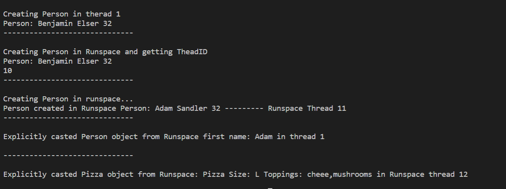

# Creating and Passing Custom Types to and from PowerShell Runspaces

### Brief Synopsis:
This code demonstrates setting up and creating runspaces with injected custom types using InitialSessionState property on the PowerShell Runspsace.

### Initialize Runsapce with Custom Type
This code assumes you have the Type Person created in Namespace CustomTypes and the class has the public modifier 
```C#
        InitialSessionState iss = InitialSessionState.CreateDefault();
        TypeData ct = new TypeData("CustomTypes.Person");
        SessionStateTypeEntry sste = new SessionStateTypeEntry(ct, false);
        iss.Types.Add(sste);
        PowerShell ps = PowerShell.Create(iss)
```
or you can load an entire type file using the (string FileName) overload
```C#
        InitialSessionState iss = InitialSessionState.CreateDefault();
        SessionStateTypeEntry sste = new SessionStateTypeEntry(@"./CustomTypes.cs");
        iss.Types.Add(sste);
        PowerShell ps = PowerShell.Create(iss)
```

Looking at [Program.cs](./Program.cs) we see successfull creation of [Person objects](./People) in the runspaces and passing those Custom types around the application.

#### Expected output
<br>